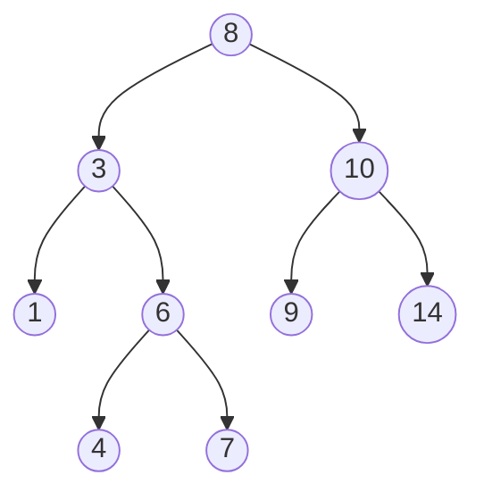
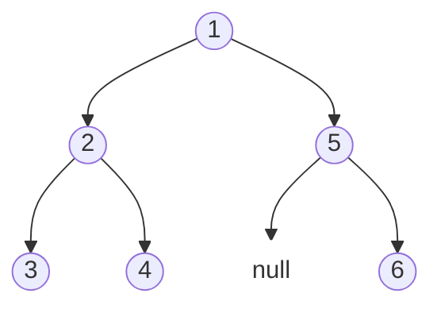

# 二叉树

## 基本功练习
首先这几个遍历顺序，要非常熟悉，学会用递归和迭代两种方式实现
因为二叉树的算法题基本上离不开遍历，把基础打好才能在二叉树上进行各种操作

- 前序遍历：根节点，左子树，右子树
- 中序遍历：左子树，根节点，右子树
- 后序遍历：左子树，右子树，根节点

## 目标
1. 在算法题中，常常遇到用数组来表示二叉树，实现一个脚本可以输入一个数组，然后打印一个可视化的二叉树

输出的结构应该包括

    - mermaid
    - ASCILL字符

## Mermaid 绘制二叉树

