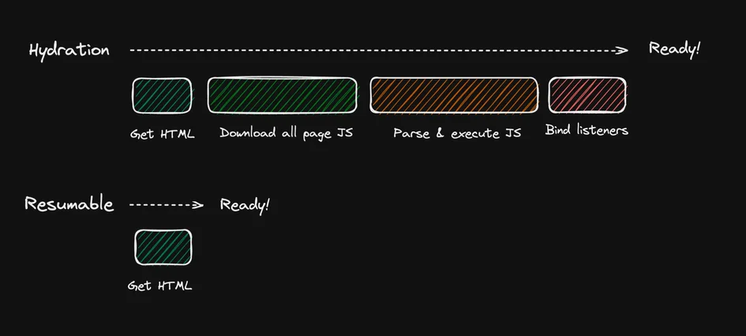

## 写在前面

12月7日，我有幸在厦门参加了第七届 FEDAY 前端开发者大会。这次大会以"前端不止AI"为主题，汇聚了来自国内外顶尖科技公司和创新企业的前端精英，共同探讨前端技术在 AI 时代的机遇与挑战

大会的演讲嘉宾阵容强大，涵盖了来自腾讯、字节跳动、阿里巴巴等知名科技巨头的前端专家，以及Hugging Face等前沿科技公司的核心成员。此外，一些优秀的独角兽公司创始人和海外的开发者也前来分享了他们的独到见解和实践经验

本次大会的演讲主题紧扣AI时代的前端技术发展，围绕AI大模型的技术实现、产品应用以及前端开发的新趋势展开。本文按演讲顺序依次介绍各个演讲的主题内容和我的一些个人感悟

**相关链接**

*   FEDAY大会议程总览和PPT下载：<https://fequan.com/2024/#schedulesRef>
*   会议录屏：<https://space.bilibili.com/388510269>

## 大会内容

### 1. 使用 Gradio 和 Transformers 构建 Web AI应用


**演讲嘉宾**

Yuichiro: Hugging Face工程师，机器学习开发者大使

**演讲内容**

本次分享深入探讨了如何利用 `Gradio`和`Transformers` 构建机器学习应用的 Web 演示界面, `Yuichiro` 通过几个案例演示了如何快速搭建大模型应用，比如：汉译英翻译应用，猫咪品种识别和餐馆点评星级判断，还讲述了基于`Pyodide`的JS库`Gradio-Lite`，可以直接在浏览器中运行Python代码和`Gradio`

`Gradio` 作为一个强大的开源 Python 库，其核心优势在于：
- 提供丰富的预置 UI 组件和模板
- 支持快速构建机器学习模型的交互式 Demo
- 一键生成可分享的公共 URL，便于团队内部演示

`Transformers` 则是 Hugging Face 推出的前沿机器学习工具库，具有以下特点：
- 提供统一的 API 接口访问海量预训练模型
- 显著降低计算资源消耗和碳排放
- 大幅缩短模型应用的开发周期


特别值得关注的是基于 `Pyodide` 开发的 `Gradio-Lite`，这个创新性的 JS 库实现了在浏览器端直接运行 `Python` 代码和 `Gradio` 应用，为开发者提供了更灵活的部署选择。

这套工具链的核心优势可以总结为：
1. **开发效率**：通过现成组件快速构建专业的 Web 演示界面
2. **离线使用**：模型本地化部署，确保稳定性能
3. **便捷分享**：内置 URL 生成功能，简化部署流程

```html
<html>
<head>
    <script type="module" crossorigin src="https://cdn.jsdelivr.net/npm/@gradio/lite/dist/lite.js"></script>
    <link rel="stylesheet" href="https://cdn.jsdelivr.net/npm/@gradio/lite/dist/lite.css" />
</head>
<body>
    <gradio-lite>
        import gradio as gr
        from transformers_js_py import pipeline

        pipe = await pipeline('sentiment-analysis')

        demo = gr.Interface.from_pipeline(pipe)

        demo.launch()

        <gradio-requirements>
            transformers-js-py
        </gradio-requirements>
    </gradio-lite>
</body>
</html>
```

**个人感悟**

对于不熟悉前端技术的 `Python` 开发者来说，这套工具链极为友好。它有效地简化了 AI 应用开发中许多 **冗余的** 前端工作，例如 UI 设计和页面布局，使开发者能够更**专注于模型功能的实现**，同时它还支持在HTML 文件中嵌入 `Python` 代码并在浏览器中直接运行，在需要本地化部署大模型的场景中尤为实用。无论是快速搭建Demo，还是进行模型演示和分享，相信`Gradio`和`Transformer`的结合都能显著提升开发效率，简化流程

**相关链接**

-  Gradio-Lite and Transformers.js实战：<https://www.gradio.app/guides/gradio-lite-and-transformers-js>
- Hugging Face Transformers介绍：<https://huggingface.co/docs/transformers/en/index>

### 2.AI 流式结构化输出解决方案

**演讲嘉宾** 

吴亮（月影）：波波熊联合创始人，前字节跳动ByteTech负责人

**演讲内容**

月影的演讲主要介绍了波波熊自研的工作流框架-`Ling（灵）`如何实现流式输出 `JSON` 结构的数据响应

波波熊的业务模型通常使用结构化的 `JSON` 作为输入输出，但是 `JSON` 特有的封闭式数据结构与流式输出天然冲突，如果流式输出过程中 `JSON`  结构不完整，前端就无法立即使用这些输入，造成了流式输入的优势丧失

框架`Ling`的核心是一个实时解析 `JSON Token` 的解析器，将实时解析的内容立即以 `Stream` 的方式，用 `JSONURI` 的数据协议格式发送给前端处理，而且默认支持 `Server Sent Events`，让前端能够立即接收并更新结构化数据，同时还带有自动补全和错误修复的功能

比如，对于下面的`JSON`数据:
```json
{
  "outline": [
    {
      "topic": "What are clouds made of?"
    },
    {
      "topic": "Why do clouds look soft?"
    }
  ]
  // ...
}
```

经过框架`Ling`的处理，可以转换成如下`JSONURI`的格式, 这样前端就无需等待全部`JSON`数据传输完成，可以立即使用这些数据，而且也可以在后续的流式输出过程中持续更新数据
```json
...
data: {"uri": "outline/1/topic", "delta": "Why"}
data: {"uri": "outline/1/topic", "delta": "do"}
data: {"uri": "outline/1/topic", "delta": "clo"}
data: {"uri": "outline/1/topic", "delta": "uds"}
data: {"uri": "outline/1/topic", "delta": "loo"}
data: {"uri": "outline/1/topic", "delta": "k"}
data: {"uri": "outline/1/topic", "delta": "sof"}
data: {"uri": "outline/1/topic", "delta": "t"}
data: {"uri": "outline/1/topic", "delta": "?"}
...
```

**个人感悟**

`Ling`框架从实际业务中的问题出发并实现了解决方案，非常值得学习，通过这场演讲我也了解到`JSON`在AI工作流中的重要性：它自带意义的结构和语义化的字段名，能够让 AI 更好得理解工作内容，大大节省提示词，同时 `JSON` 的扩展性也增加了工作流的扩展能力

月影在演讲中也分享了一些**提示词技巧**，他并未过度强调提示词工程的重要性，而是主张提示词应尽量简洁，避免过度工程化。这一观点与"Prompt之神"李继刚的看法不谋而合。后者同样认为，大型语言模型提示的核心在于**精炼输入词**，而提示词工程的主要作用只是辅助性

**相关链接**

-  框架`Ling`官网： https://ling.bearbobo.com/get-started.html
-  `JSONURI`介绍： https://www.npmjs.com/package/jsonuri
- 月影自己写的`Ling`的原理介绍: https://juejin.cn/post/7413228844403294249


### 3. 如何打造属于自己的Cursor

**演讲嘉宾**

谢俊鸿：蚂蚁集团云研发团队技术专家，`OpenSumi`框架负责人

**演讲内容**

本场演讲围绕AI辅助编码助手展开，首先讲述了`GitHub Copilot`的崛起，以及后续同类编码助手的兴起和微软造成的限制，演讲嘉宾强调了AI原生IDE的重要性，并介绍了`OpenSumi`框架，这是一款快速搭建**AI 原生 IDE 产品**的底层框架，由阿里和蚂蚁集团联合开发，支持Web、PC和移动端等多个平台

`GitHub Copilot`的出现让不少开发者意识到AI编码助手的重要性，它通过代码补全极大提升了开发效率，不少公司试图开发同类型的插件，但是由于微软内部对API的限制，这些插件在`VS Code`上的表现远不如`GitHub Copilot`，也正因如此，原本通过fork VS Code分支来开发IDE的`Cursor`团队最终选择了自研IDE，后者远没有`VS Code`这么多的限制，可以灵活地进行扩展，给开发者的体验极佳

像`Inline Chat`这种好用的功能`VS Code`目前只单提供给 `GitHub Copilot`使用，其余 Copilot插件只能通过右键菜单发送至对话面板中


阿里也是很有前瞻性地捕捉到了这个机会，与蚂蚁集团合作推出了`OpenSumi`框架，它原本是为了解决公司内部 IDE 产品研发的重复建设问题，如小程序研发，云端一体化等，满足更多垂直场景的定制能力，于2022年正式开源，在2023年7月开始进行AI方向的改造

演讲者就`OpenSumi`的架构，生命周期，底层依赖和核心功能的实现进行了详细的介绍，比如编辑器里多行补全窗口的实现需要结合`myers`算法提取字符级和单词极的差异来呈现代码diff，对于编辑器中的灰色代码补全和悬浮窗口则需要结合`monaco`的底层api进行渲染

**个人感悟**

作为一套高度可定制和可扩展的 AI 原生 IDE 框架，`OpenSumi`框架不仅能帮助企业快速构建智能化的代码编辑工具（包括代码补全、调试和重构等功能），还可以无缝对接企业内部的AI模型和开发工具链，从而打造完整的智能开发生态系统。这种开放性和灵活性正是区别于`VS Code`等传统IDE的关键优势


| **功能项**                   | AI原生IDE | AI插件 |
| ---------------------------- | --------- | ------ |
| 仓库级补全                   | ✅         | ✅      |
| 多行补全                     | ✅         | ❌      |
| 智能改写                     | ✅         | ❌      |
| 下一次补全预测               | ✅         | ❌      |
| 编辑器内通过自然语言生成代码 | ✅         | ❌      |
| 编辑器内快速问答             | ✅         | ❌      |
| 智能终端                     | ✅         | ❌      |
| 聊天面板                     | ✅         | ✅      |

**相关链接**
- OpenSumi: https://opensumi.com/zh/docs/integrate/quick-start/web

### 4. 2024 年的 Web AI：现代 Web 应用的超级能力

**演讲嘉宾**

Jason Mayes: Google Web AI 团队负责人

**演讲内容**

这次演讲主要围绕Web侧AI的应用的优势和未来发展前景展开，Web侧AI，也就是端侧AI，它与云端AI不同，后者需要通过网络请求在服务器端运行大模型，而前者可以直接在本地即浏览器客户端运行，因此具有更快的响应速度，同时也提供了更高的隐私性和安全性

端侧AI的低延迟保证了它广泛的应用场景，在一些网络信号不好的地点，比如飞机上，地铁上，或者一些偏远地区，都可以直接使用端侧AI进行工作，此外由于不需要在服务器端运行大模型，因此也能帮助企业大大降低运算成本

Jason列举了很多端侧AI的应用实例，比如对于超市的工作人员，用户可以直接使用端侧AI进行商品的识别，负责运动康复的医生可以直接通过笔记本摄像头记录病人的运动轨迹并提供指导，宠物摄像头运用端侧AI对宠物行为进行分析来监督宠物是否按时进食等

**个人感悟**

这位大佬在Google工作了10多年，在Web AI领域有着丰富的经验，没有亲自来现场，是通过录屏的方式分享的，他的演讲很有启发性，一直以来我们熟悉的主流AI应用，比如`ChatGPT`，都属于云端AI，而Jason则展示了端侧AI的实用性，优势和广阔的应用前景，未来前端与AI相结合一定可以创造出更多的可能性

### 5. Web3D 开发中 AIGC 的探索及工作流实践

**演讲嘉宾**

慎思: 蚂蚁集团 Galacean 团队技术专家

**演讲内容**

这场演讲首先讲述了一下Web3D的发展历程，从青铜期的手撸代码创建模型到后期开始引入引擎，编辑器等多种强大的工具，然后提到了当前3D模型开发中的常见问题，之后通过工作流迭代的方式讲述了AIGC给Web3D开发带来的变革，其中介绍了蚂蚁集团自研的Web3D引擎和编辑器：`Galacean Engine`

`Galacean Engine` 是由**蚂蚁RichLab**前端团队开发的开源Web引擎，采用组件化架构并用 `Typescript` 编写。它实现了渲染、物理、动画、交互、XR（扩展现实）支持等功能，并提供了具备完善工作流的可视化在线编辑器`Galacean Editor`，让用户在浏览器环境下就能创作精美的 2D/3D 互动应用

演讲嘉宾展示了一个完整的Web3D开发工作流逐步被AI技术工具迭代的过程，展示了AIGC给Web3D领域带来的变革，在原本工作流的中的美术设计，建模，到实际开发中的模型编辑，特效处理等步骤，现在都可以通过AIGC来完成，极大地提升了开发效率，然后还深入讲解了一些AI生成3D模型背后的底层算法-3DGS(三维高斯抛雪球算法)，并讨论了一些AI生成3D模型中可能遇到的问题，如样本资料不足和特殊材质的生成


**个人感悟**

这场是我觉得PPT视觉效果最好的演讲，主办方很贴心的考虑到大家午饭后容易打瞌睡，所以专门安排这场视觉元素丰富的演讲在下午

之前接触过不少文生图的AI应用，但对AI生成3D模型这种更专业的应用还是第一次，通过聆听慎思作为从业者AI对于现有工作流的迭代的详细分享，让人更直观的感受到AI对技术生产力的驱动，现在的工具已经可以做到一句话就能生成一个包含角色，场景，动作，特效的完整3D世界，也许VR游戏，虚拟现实，元宇宙等应用场景的变革就在眼前


**相关链接**
- Galacean Engine：https://galacean.antgroup.com/engine/docs/basics/overview/

### 6. Midscene.js 用 AI 构建下一代 e2e 测试工具

**演讲嘉宾**
周晓: 字节跳动 Web infra 团队成员，`Midscene.js`核心开发者

**演讲内容**
演讲主要分为三个大模块:

1. 首先介绍了传统UI自动化测试的痛点，无论是通过测试脚本编写还是人工视觉检查都有相对的局限性，
2. 然后介绍了`Midscene.js`的原理和应用，这是一个多模态 AI 驱动 UI 自动化工具，通过 AI agent 能够实现自然语言控制页面、页面信息提取、断言页面状态
3. 最后演讲者介绍了在开发`Midscene.js`过程中所积累的AI在前端团队落地的实践经验

接触过的很多开发，包括我，都比较抗拒写UI测试，因为测试脚本编写起来非常繁琐，而且带来的效益也相当有限，但是`Midscene.js`通过 AI 执行交互、提取数据和断言, 不仅让编写测试变得非常简单，而且能够自动生成提供可视化报告和调试 Playground，大大提升了UI测试的效率和体验，这是一个我将来会尝试去学习和使用的工具


```js
// 👀 输入关键字，执行搜索
// 注：尽管这是一个英文页面，你也可以用中文指令控制它
await ai('在搜索框输入 "Headphones" ，敲回车');

// 👀 找到列表里耳机相关的信息
const items = await aiQuery(
  '{itemTitle: string, price: Number}[], 找到列表里的商品标题和价格'
);

console.log("headphones in stock", items);
```


**个人感悟**

周晓在关于AI与前端技术的融合经验的分享十分值得一听，他强调了开发者要首先了解LLM在特定场景下的能力表现，比如文本理解和数字能力，在应用之前也要明确业务需求从而确定AI应用的场景和目标，分析其可行性，最后就是建立起一个量化的评价体系，通过一些指标来判断产品是否通过AI应用有所优化

**相关链接**

- Midscene.js官网：https://midscenejs.com/zh/index.html
- Midscene.js GitHub：https://github.com/web-infra-dev/midscene

### 7. 基于端+云打造 AI 应用

**演讲嘉宾** 

谢亚东: Lepton AI Founding Member

**演讲内容**

这场分享主要是关于端与云结合的AI应用开发架构的优势，首先嘉宾列举了一下现在最流行的生成式AI产品，如ChatGPT，绝大多数都是云端AI，包括这些生成式AI的底层架构

然后又介绍了一些端侧AI的应用，比如：在线会议应用Google Meet的会议表情包功能，以及**Chrome浏览器的Built-in AI项目**，让开发者可以直接在命令行中就能调用AI大模型，然后就端侧AI的优缺点进行了一个更全面的分析

【【此处需要加图关于Chrome Bulit_inAI】】

接着，演讲嘉宾举了一个有趣的例子来演示`Hybrid AI`应用即端侧+云测AI应用的优势，这个事件源于Open AI研发的语音识别AI-`Whisper`在识别杂音方面的问题，根据`AP News`的一篇报道，美国一些医院在使用`Whisper`模型来记录并分析病人与医生之间的对话时，发现模型常常会出现"闹鬼"的现象：在无人说话的时候产生严重的**AI幻觉**，编造出一些根本不存在的对话，

这个时候端侧AI就可以发挥其作用，在将对话数据送到服务端处理前，在客户端就通过端侧模型对语音数据进行筛选从而排除无意义的语音输入

**个人感悟**

这场演讲再次从一个更**全面**的角度讲解了端侧AI的实用性，建议与上面Jason的演讲结合食用，虽然端侧AI可以减少成本，保证隐私与安全，但是由于使用的模型质量不如云侧AI，它的生成质量和模型表现也会理所当然得下降，端侧AI的优势在于其低延迟和可离线使用，而云侧AI的优势在于其高生成质量，所以端侧+云测的混合模式才更像是未来AI应用的主流架构


**相关链接**

-    Lepton AI： <https://www.lepton.ai/>
-   Google Chrome Built-in AI - Early Preview Program: <https://docs.google.com/forms/d/e/1FAIpQLSfZXeiwj9KO9jMctffHPym88ln12xNWCrVkMY_u06WfSTulQg/viewform>
-   `AP News`关于`Whisper`闹鬼事件的报道：<https://apnews.com/article/ai-artificial-intelligence-health-business-90020cdf5fa16c79ca2e5b6c4c9bbb14>
### 8. Qwik: Resumability(可恢复性) 将引领时代

**演讲嘉宾** 

毛雨乐 Maïeul: `Qwik` 和 `Qwik UI` 核心团队成员

**演讲内容**

演讲主要围绕`Qwik`这一前端框架的相关特性展开，`Qwik`框架的核心功能在于实现了全新的JS加载方法-`Resumability`来进一步优化SSR网页应用的表现，主流的前端框架比如`Next.js`、`Nuxt.js`都在使用`Hydration`来完成交互，这一做法的缺陷在于需要等待JS的下载，编译和执行等步骤完成后才能正常使用页面，而这就会造成很长的`TTI(Time to Interactive)`-可交互等待时间

之前有`Astro`框架创新性地提出了`Partial Hydration`的架构模式，通过将页面分解为多个独立的`Isalnd`组件，让用户自定义不同组件的加载策略来优化页面速度，`Qwik`框架则是更进一步，直接实现`Zero Hydration`



实现`Zero Hydration`的关键在于通过`Serialization`，即**序列化**，将JS代码合并到HTML上，类似`JSON.stringify`但比后者功能更全面

`Hydration`比较耗时的原因之一就是因为这过程中需要加载和处理事件监听器，组件树结构，组件状态等，而Qwik通过序列化的方式，在服务端渲染时直接将监听器等属性信息序列化成字符串，在客户端加载时再反序列化成函数，从而实现了可恢复性`Resumability`

用户初次打开`Qwik`项目的页面时完全无需加载JS，只加载HTML元素，所以访问速度极快，再通过懒加载机制只加载用户当前需要访问的组件，进一步提升了页面速度
****

```html
// Qwik编译后的HTML
<button on:click="./chunk.js#handler_symbol">click me</button>
```

**个人感悟**

Qwik的这种序列化处理操作也是相当新颖的，今年的`State-of-Frontend 2024`报告中也能看到不少开发者有兴趣尝试这个比较年轻的框架，相信日后会看到更多`Qwik`相关的项目

演讲嘉宾毛雨乐是一个法国人，却坚持用纯中文完成了演讲，他的中文说得算比较不错的了，这场演讲也是本次大会的一个分水岭，到此开始的演讲都跟AI关系不大，而是更多围绕前端技术展开


**相关链接**
- Qwik官网：https://qwik.dev/docs/
- Qwik GitHub：https://github.com/BuilderIO/qwik

### 9. 微信端内网页远程调试及断点原理

**演讲嘉宾**

邱焱坤: 腾讯微信公众号团队高级前端工程师

**演讲内容**

微信公众号的用户规模相当大，所以其图文界面会在各种不同的环境和平台中被访问，从而引起各种各样的兼容性问题，这个时候就需要一个调试工具来统一抹平不同平台的调试差异

出于这个目的，微信工程号团队基于`Chrome DevTools Protocol`(CDP)实现开发了微信端内网页远程调试工具`mprdev`

除此之外，还抽象出来了断点工具`vDebugger`以支持在 JSCore 等非浏览器环境下进行断点调试, 不依赖平台内核接口而是通过协程的方式，使得 SDK 能在不同环境下均能提供较为完整的调试体验

这其中的难点包括理解`WebSocket`如何用于在`Chrome DevTools`和终端设备之间转发调试信息，以及在`JavaScript`环境中实现断点涉及到对代码的自动插桩和执行流程的控制，需要对`JavaScript VM`和调试器都有深入的了解

**个人感悟**

远程调试和断点调试都是前端开发中非常实用的调试技术，远程调试可以让开发者在本地环境中对运行在远程服务器或不同设备上的Web应用进行调试，断点调试通过让开发者设置断点，可以检查程序在某个节点的状态， 从而逐步跟踪代码的执行过程，并查找修复潜在的错误

这次演讲可以让我们更好地理解这些工具的实现原理，对前端开发者有很高的参考价值，也为其他领域的调试工具开发提供了有益的思路

**相关链接**
- `vDebugger`: https://github.com/wechatjs/vdebugger?tab=readme-ov-file
- `MpRdev`: https://github.com/wechatjs/mprdev

### 10. ESLint One for All Made Easy

**演讲嘉宾**

Anthony Fu: Vue核心团队成员

**演讲内容**

本次演讲介绍了`ESLint`新版本`v9.0.0`引入的相关特性，着重介绍了扁平配置`Flat Config` 的使用方法和它带来的优化，嘉宾还介绍了如何通过新的`ESlint`特性实现一个通用的配置方案来优化开发流程，如通过自动格式化，代码重构，以及扩展ESLint到其他语言

**个人感悟**

扁平配置`Flat config`于2022年推出，在`ESLint`的v9.0.0版本中成为默认配置系统，相比期旧版本有以下几个主要改进:

1.  **单一配置来源**：新的配置中统一使用`eslint.config.js` 或是 `.cjs` `.mjs`作为全局配置文件，过去的eslint配置来源比较杂，可以通过多个不同类型的文件如`.eslintrc`, `.eslintrc.js` 甚至包括`package.json`等进行配置
2.  **继承方式**：过去的继承配置需要在`extends`属性中指定，新版本更为直观，通过导出一个对象数组，用户可以在数组中的不同对象中指定不同类型的文件lint配置，需要继承额外配置时只需要将其插入到数组中即可
3.  **插件引用**：过去eslint通过全局的`plugins`属性来引用插件，在新的扁平结构中通过import以变量的形式引用，在对象中加入`plugins`属性即可

  ```json
  // .eslintrc.json
{
     "extends": [
       "eslint:recommended",
       "plugin:@typescript-eslint/recommended"
     ],
     "plugins": [
         "vue",
         "n"
      ]
   }
```
   
```js
import customConfig from "eslint-config-custom";
import jsdoc from "eslint-plugin-jsdoc";

export default [
    customConfig,
    {
        files: ["**/*.js", "**/*.cjs"],
        plugins: {
            jsdoc
        },
        rules: {
            "semi": "error",
            "no-unused-vars": "error"
        }
    },
    {
        files: ["**/*.js"],
        rules: {
            "no-undef": "error",
            "semi": "warn"
        }
    }
];
```
   
Anthony在演讲中指出，新的扁平配置通过简化配置方式，进一步提升了可维护性，从而使得`ESLint One for All`的配置方法成为可能，

1. 扁平化配置提供了一个单一的配置源头`eslint.config.js`，开发者通过维护一个ESLint配置，就能让它被多项目共享减少重复工作，确保不同项目遵循相同的代码风格和质量标准
2. 高度的可定制能力，**数组**格式的配置项可以让开发者根据项目更灵活地组合配置和插件，从而支持 JavaScript、TypeScript、Vue等多种语言和框架
3. 动态生成配置：一些框架（如 Nuxt）可以根据当前项目的特性自动生成合适的 `ESLint`扁平化配置，并运行ESLint check来检查代码风格和质量

**个人感悟**

本次开发者大会的最后一个演讲，请来了前端圈的名人`Anthony Fu`，他不仅是`Vue`和`Nuxt`的核心开发，也是一个狂热的开源爱好者，开发了不少好用的工具如`Slidev`，这次演讲中的不少插件也是由他实现

随着项目规模的扩大，配置和管理 `ESLint` 变得越来越复杂，尤其是对于企业团队，维护多个项目的配置文件会非常繁琐，`ESLint`在新版本中通过扁平化配置进行简化在我看来是一个预料之中的改进，不仅简化了配置源，而且让配置管理更加灵活，Anthony在演讲中提到的`ESLint One for All`，通过一个配置适配所有项目的理念应该会在企业或者其他大型开发团队中得到更广泛的推广

**相关链接**

- 扁平配置 `Flat config` 介绍：https://eslint.org/blog/2022/08/new-config-system-part-2/
- Nuxt ESLint：https://eslint.nuxt.com/
- 配置可视化`Config Inspector`: https://github.com/eslint/config-inspector
- Anthony Fu本人的`ESLint`配置：https://github.com/antfu/eslint-config


## 总结

本次 FEDAY 大会的演讲内容充实且富有深度，演讲嘉宾们不仅展示了如何将当前最前沿的 AI 技术融入前端开发，还探讨了如何利用 AI 大模型创造出全新的 Web 应用和开发工具。让我印象最深刻的是，`Midscene.js`如何将**自然语言处理技术**应用于前端UI测试，显著提升了开发效率和体验

主办方在紧扣 AI 主题的同时，仍不忘初心，留出了宝贵的时间分享了其他前沿的前端技术，如`Qwik`框架和ESLint扁平配置。这让人深刻体会到，"前端不止于 AI"，前端技术的未来是多元化的，AI 只是其中的一部分

感谢主办方和所有参与者的努力和贡献，让我们共同期待下一次的技术盛会


