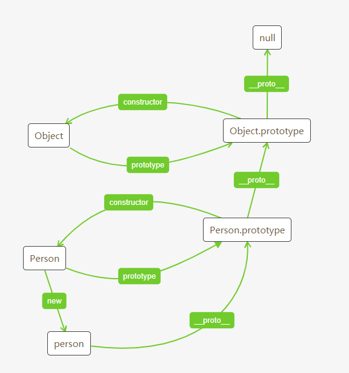

## 1. 自我介绍

## 2. 开发相关
- 平常是怎么使用git，怎么创建新的分支
- 上一家公司怎么进行code review的
- 用过哪些AI工具来帮助自己开发提效


## 3. CSS
### CSS优先级, 哪个优先级是最高的

  - !important > 内联样式 > ID选择器 > 类选择器 > 标签选择器

### 用CSS实现居中对齐有哪些方式

### 有没有用过display: grid, 它有什么限制

**定义**

grid即网格布局

网格就是一组相交的水平线和垂直线，它定义了网格的列和行，可以将网格元素放置在与这些列和行相关的位置上

将一个页面划分为几个主要区域，定义这些区域的大小，位置，层次等关系

网格布局方便让我们按照行和列来对齐元素，而且比表格更简单

**实例**
- grid-template-rows和grid-template-columns定义了网格上的行和列，或者说定义了网格的轨道
```css
  display: grid;
  grid-template-columns: repeat(3, 1fr);
```

**嵌套网格**

在父元素已经使用网格布局的情况下，子元素是可以接着使用网格布局的
- 默认不会继承父元素的gap值等， 除非使用`grid-template-columns: subgrid`就会沿用父网格轨道来布局项目

**兼容性**

**主要参考**
1. https://www.smashingmagazine.com/2017/11/css-grid-supporting-browsers-without-grid/

CSS兼容性问题，截止2017年，主流浏览器都支持网格布局, 但是学习如何让旧版本的浏览器兼容新的CSS特性也是很有价值的
- 比如UC浏览器就暂时不支持网格布局

Polyfill 是 Web 开发中的一个重要概念，它的作用是帮助开发者在不支持某些新特性的旧浏览器中实现这些特性，从而确保代码的兼容性

**浏览器会直接跳过他们无法理解的CSS**

**具体实现**

所以我们可以按如下的方式书写css
  - 这样旧浏览器可以用table-cell的格式来实现网格布局，而新浏览器因为可以运行display: grid就可以接着正常使用grid支持的网格布局
```css
display: table-cell;
display: grid;
```

通过float和百分比width来模拟grid, 只要总百分比不超过100%就不会出问题
```css
.grid > * {
  float: left;  
  width: 33%;
}
```

- 一个可能的问题在于百分比width会影响能正常使用grid布局的元素， 我们可以用下方的CSS **at规则**来进行修正

- @supports——如果满足给定条件则条件规则组里的规则生效
```css
@supports (display:grid) {
  .grid > * {
    width: auto;
  }
}
```

在需要验证某个CSS特性或者JS特性的浏览器兼容性的时候，怎么去查
  - 直接使用caniuse网站检查主流浏览器对这个特性的支持
  - 可以在browserStack网站在浏览器中运行虚拟环境进行检查
  
**CSS中transition和animation的区别**
  
Transition属于补间动画，即设置关键帧的初始状态，然后在另一个关键帧改变这个状态
- Animation可以理解是CSS Transition的加强
  - 既可以实现 补间动画 的动画效果，也可以使其以 逐帧动画 的方式进行绘制。
- 总结
  - 如果只是想元素样式变化有个简单过渡，使用 css transition 就行。
  - 如果想让元素动画效果一直持续，或者有更多的控制(暂停、恢复、反向播放) 则需要 css animation。
  - 另外动画执行需要和JS交互的话，那么 Javascript 版的 Web Animation Api 则更合适。

**Transition实战**

transition其实是一个简写属性，跟flex一样，它还包括多个子属性
- transition-property： 指定哪个或哪些 CSS 属性用于过渡
- transition-duration： 指定过渡的时长
- transition-timing-function： 指定一个缓动函数，定义属性值怎么变化
- Delay: 制定属性开始变化到实际开始发生之间的时长
  - 如hover一秒后开始transition
```css 
/* 单条 简写形式 */
transition: 
    <property> <duration> <timing-function> <delay>;
    
  div {
    opacity: 1;
  }
  
  div:hover {
    opacity: 0.5;
    transition: opacity, 3s;
  }
 ``` 


## 4. JavaScript
### JS有哪些基础类型
- 首字母都是大写
- String, Number, Boolean, Null, Undefined, BigInt, Symbol

既然问到了这个，那就可以顺便回答一下对象类型
  - Object, Array, Function, 以及RegExp和Date

### **JS中值类型和引用类型有什么不同**

从储存方式的角度来说，值类型是存储在**栈内存**中，栈内存包括变量的标识符和值

而对于引用类型，
- 栈内存中保存了变量标识符和指向堆内存中该对象的指针
- **堆内存**中保存了对象的内容

### JS里的深拷贝一般怎么实现，有哪些现成的第三方库可以用
结合上个问题， 赋值对象时，只复制了栈内存中的指针/引用堆内存的地址

复制后的变量并跟原变量没有完全断开，修改哪一方都会影响另外一方

深拷贝才能完全拷贝成两个单独的存在，指向不同的堆内存地址


### 讲一下事件循环

事件循环是JS中的一种机制，用于协调同步任务和异步任务的执行，通过引用任务队列，可以使异步任务非阻塞地运行，

这是因为JS是一种单线程语言，JS主线程和渲染线程互斥，如果异步操作阻塞JS的执行，就导致浏览器假死

当任务进入执行栈后，如果判断是异步任务，就将异步任务挂起，在任务队列中加入一个回调函数代表异步任务的运行结果

只有当执行栈为空时，也就是所有同步任务都执行完成了，系统才会从任务队列中取出一个回调放在主线程中执行

#### 进阶
面试答上面的算合格了，我们可以更近一步，讲讲异步任务中微任务和宏任务的区别

- 微任务会在宏任务之前执行
- 微任务是由ES6语法规定的，而宏任务是由浏览器规定的
- 微任务在DOM更新之前执行，而宏任务在DOM更新之后
- 常见的微任务包括：process.nextTick、Promise 的 .then()、.catch() 和 async/await，
- 常见的宏任务包括：setTimeout、setInterval、setImmediate、requestAnimationFrame


### **事件循环中的微任务和宏任务平时有没有用到过**，比如Vue中的this.$nextTick
nextTick的主要作用是保证在Vue组件的DOM更新完成之后再去执行相应操作

在Vue中，当响应式数据发生变化时，最终的DOM更新并不是同步生效，Vue将开启一个异步更新队列，直到下一个tick才一起执行

这种模式是为了确保每个组件无论发生多少状态改变，都仅执行一次更新

this.$nextTick() 可以将里面的回调函数延迟下次DOM更新循环结束后执行

### **介绍一下JS中的原型和原型链**

原型和原型链最方便的学习方法还是看图，更好理解

另外还有自己手撸几个代码就懂了

- 在JS中，每个实例对象都有一个内部属性`__proto__`，它指向该对象的**原型**。
- 这个原型是另一个对象，包含了可以**被继承的方法和属性**。
- 原型链是由一系列对象组成的，每个对象通过其`__proto__`属性指向其原型，直到到达null，这表示链的终点
- 在JavaScript中，每个对象都有一个特殊的隐藏属性，通常称为__proto__（在浏览器中），或者在ES6中使用Object.getPrototypeOf()和Object.setPrototypeOf()方法来访问和设置对象的原型。这个属性指向了对象的原型对象

**作用**

原型对象的作用，是用来存放实例中共有的那部份属性、方法，可以大大减少内存消耗

**原型链的继承**

- 通过__proto__相连接，一个实例的__proto__指向原构造函数的prototype属性
- 通过原型链，一个对象可以继承其原型对象的属性和方法
- 当访问一个对象的属性或方法时，如果在该对象本身找不到，JavaScript引擎会沿着原型链向上查找，直到找到该属性或方法，或者到达原型链的末端（null）
```js
Person.prototype.constructor === Person // **准则1：原型对象（即Person.prototype）的constructor指向构造函数本身**
person01.__proto__ === Person.prototype // **准则2：实例（即person01）的__proto__和原型对象指向同一个地方**
```
**原型链与构造函数**

谈到原型链，就不得不谈构造函数`constructor`
- 一个类的`prototype`的`constrcutor`指向这个类本身



### 如果想要创建一个原型为空的对象应该怎么做

先回答怎么创建一个对象，这种方式创建的对象，它的原型是`Object.prototype`

```js
const obj = {}
// 等价于
const obj = new Object()
```

然后再回答怎么创建一个原型为空的对象

```js
const obj = Object.create(null)
```

然后再回答怎么修改一个对象的原型

```js
Object.setPrototypeOf(obj, null)
```


5. TypeScript
- TS中的type和interface有什么区别
- 项目中的.d.ts的作用？
- 为什么大型项目中要使用TS


6. 框架
- Vue3和Vue2的区别
- Vue3和React的区别
- React中，useEffect是如何使用的，依赖项传与不传的区别


7. HTTP协议
- 浏览器缓存是如何实现的
- 平常开发中打包后的HTML文件以及JS， CSS文件的处理方式
- **localStorage, sessionStorage和IndexedDB的区别**
- **跨域是什么，如何从纯前端的角度实现跨域**


8. 项目经验
- 说一下自己实现过的最难的项目
- 开发过程中遇到页面卡顿的情况，应该怎么处理（提示：可以用devtools的Performance）
- 怎么样实现一个可拖拽的元素


9. 公司相关
- 有没有用过编程猫的产品
- 如果要你用AI对话框实现一个编程猫产品的积木模块的添加功能，你要怎么实现


10. 反问环节


#编程猫#
#线下#
#前端#
#社招#
#面经#


