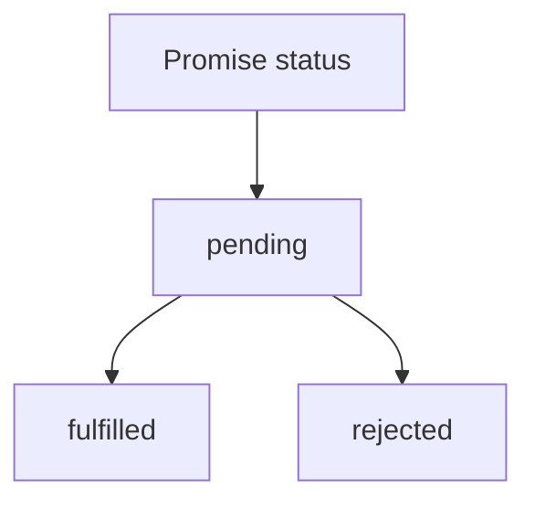

# 手写Promise

## 背景
最近面试被问到如何手写`Promise.all`，发现我对Promise的理解不够深入，所以决定自己写一个Promise，加深理解。

## 理解Promise
Promise是JavaScript中用于处理异步操作的对象。它有三种状态：pending、fulfilled和rejected。

Promise的状态一旦改变，就不会再改变。

### 思维导图

