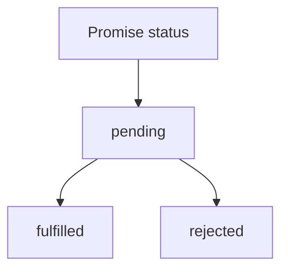

# 手写Promise

## 背景
最近面试被问到如何手写`Promise.all`，发现我对Promise的理解不够深入，所以决定自己写一个Promise，加深理解。

## 理解Promise
Promise是JavaScript中用于处理异步操作的对象。它有三种状态：pending、fulfilled和rejected。

Promise的状态一旦改变，就不会再变，不可能从fulfilled变为pending，或者从rejected变为pending。

Promise本身接受一个参数executor, executor接受两个参数resolve和reject，resolve和reject是两个函数，用于改变Promise的状态。
- resolve: 将Promise的状态从pending改为fulfilled, 执行onFulfilled回调函数, 设置Promise的value
- reject: 将Promise的状态从pending改为rejected, 执行onRejected回调函数, 设置Promise的reason

### 思维导图




## 实现Promise

### 1. 实现Promise类

```javascript
class MyPromise {
  constructor(executor) {
    this.status = 'pending';
    this.value = undefined;
    this.reason = undefined;

    this.onFulfilledCallbacks = [];
    this.onRejectedCallbacks = [];

    const resolve = (value) => {
      if(this.status !== 'pending') return;
      this.status = 'fulfilled';
      this.value = value;
      this.onFulfilledCallbacks.forEach(callback => callback());
    }

    const reject = (reason) => {
      if(this.status !== 'pending') return;
      this.status = 'rejected';
      this.reason = reason;
      this.onRejectedCallbacks.forEach(callback => callback());
    }

    try {
      executor(resolve, reject);
    } catch (error) {
      reject(error);
    }
  }
}
```

### 2. 实现Promise的then方法

Promise.then案例
```js
const promise = new Promise((resolve, reject) => {
  setTimeout(() => {
    resolve('success')
  }, 2000); 
})

promise.then(value => {
  console.log(1)
  console.log('resolve', value)
})
 
promise.then(value => {
  console.log(2)
  console.log('resolve', value)
})

promise.then(value => {
  console.log(3)
  console.log('resolve', value)
})
// Output:
// 1
// resolve success
// 2
// resolve success
// 3
// resolve success
```

```javascript
MyPromise.prototype.then = function(onFulfilled, onRejected) {
  if (this.status === 'fulfilled') {
    onFulfilled(this.value);
  }
};
```

```js
// MyPromise.js

// 先定义三个常量表示状态
const PENDING = 'pending';
const FULFILLED = 'fulfilled';
const REJECTED = 'rejected';

// 新建 MyPromise 类
class MyPromise {
  constructor(executor){
    // executor 是一个执行器，进入会立即执行
    // 并传入resolve和reject方法
    executor(this.resolve, this.reject)
  }

  // 储存状态的变量，初始值是 pending
  status = PENDING;

  // resolve和reject为什么要用箭头函数？
  // 如果直接调用的话，普通函数this指向的是window或者undefined
  // 用箭头函数就可以让this指向当前实例对象
  // 成功之后的值
  value = null;
  // 失败之后的原因
  reason = null;
  
  onFulfilledCallbacks = [];
  onRejectedCallbacks = []

  // 更改成功后的状态
  resolve = (value) => {
    // 只有状态是等待，才执行状态修改
    if (this.status === PENDING) {
      // 状态修改为成功
      this.status = FULFILLED;
      // 保存成功之后的值
      this.value = value;
      //   this.onFulfilledCallback && this.onFulfilledCallback(value)
      while(this.onFulfilledCallbacks.length){
            this.onFulfilledCallbacks.shift()(value)
      }
    }
  }

  // 更改失败后的状态
  reject = (reason) => {
    // 只有状态是等待，才执行状态修改
    if (this.status === PENDING) {
      // 状态成功为失败
      this.status = REJECTED;
      // 保存失败后的原因
      this.reason = reason;
    //   this.onRejectedCallback && this.onRejectedCallback(reason)
        while(this.onRejectedCallbacks.length){
            this.onRejectedCallbacks.shift()(reason)
      }
    }
  }
  
  then(onFulfilled, onRejected){
      const promise2 = new MyPromise((resolve, reject) => {
          console.log('status', this.status)
          if(this.status === FULFILLED){
              const x = onFulfilled(this.value)
                //   onFulfilled(this.value)
                resolvePromise(promise2, x, resolve, reject)
            //   queueMicrotask(() => {
            //     const x = onFulfilled(this.value)
            //     //   onFulfilled(this.value)
            //     resolvePromise(promise2, x, resolve, reject)
            //   })
              
          }else if(this.status === REJECTED) {
              onRejected(this.reason)
          }else if(this.status === PENDING){
              this.onFulfilledCallbacks.push(onFulfilled)
              this.onRejectedCallbacks.push(onRejected)
          }
      })
      
      return promise2
      
  }
}

function resolvePromise(promise2, x, resolve, reject){
    if(promise2 === x){
        return reject(new TypeError('Chaining cycle detected'))
    }
    if(x instanceof MyPromise){
        x.then(resolve, reject)
    }else{
        resolve(x)
    }
}

const promise = new MyPromise((resolve, reject) => {
  resolve(100)
})
const p1 = promise.then(value => {
  console.log(value)
  return p1
})


function other () {
  return new MyPromise((resolve, reject) =>{
    resolve('other')
  })
}

```

### 3. Promise的静态方法

Promise.resolve
- 输入 value, 可以是一个Promsie或者thenable对象
- 返回一个Promise, 状态为fulfilled或者传入的Promise本身

Promise.reject
- 输入 reason, 返回一个Promise, 状态为rejected

### 3. 实现Promise的三个并用请求方法
Promise.all, Promise.any, Promise.race这三者的参数都是可迭代对象，然后都是返回一个Promise，所以可以放在一起实现。
首先，理解Promise.all的用法：

```js
// All values are non-promises, so the returned promise gets fulfilled
const p = Promise.all([1, 2, 3]);
// The only input promise is already fulfilled,
// so the returned promise gets fulfilled
const p2 = Promise.all([1, 2, 3, Promise.resolve(444)]);
// One (and the only) input promise is rejected,
// so the returned promise gets rejected
const p3 = Promise.all([1, 2, 3, Promise.reject(555)]);

// Using setTimeout, we can execute code after the queue is empty
setTimeout(() => {
  console.log(p);
  console.log(p2);
  console.log(p3);
});

// Logs:
// Promise { <state>: "fulfilled", <value>: Array[3] }
// Promise { <state>: "fulfilled", <value>: Array[4] }
// Promise { <state>: "rejected", <reason>: 555 }
```

### 参数
iteratable
- 一个可迭代对象，例如数组或者字符串

### 返回值
返回一个Promise
- 状态
  - 同步fulfilled: 参数为空数组
  - 异步fulfilled: 所有Promise都成功
  - 异步rejected: 有一个Promise失败，rejected原因是第一个失败的Promise的错误信息

- 面试官让我手写Promise.all: https://juejin.cn/post/7006200103157383175
- 原生的`Promise.all`有什么特点
  - 特点1：接收一个可迭代对象
  - 特点2：传入的数据中可以是普通数据，也可以是Promise对象
  - 特点3：可迭代对象的promise是并行执行的，保持输入数组的顺序和输出数组的顺序一致
  - 特点4：传入数组中只要有一个reject，立即返回reject
  - 特点5：所有数据resolve之后返回结果

```javascript
Promise.all = function(iterable) {
  return new Promise((resolve, reject) => {
    // 判断promises是否是数组
    if(!Array.isArray(iterable)) {
      return reject(new TypeError('Promise.all requires an array'));
    }
    const result = new Array(iterable.length);
    let completed = 0;

    iterable.forEach((promise, index) => {
      Promise.resolve(promise).then(res => {
        result[index] = res;
        completed++
        if(completed === iterable.length) {
          resolve(result);
        }
      }).catch(err => {
        reject(err);
      })
    });
  });
};
```

### 4. 实现Promise.any

`Promise.any`的用法：
```js
// All values are non-promises, so the returned promise gets fulfilled
const p = Promise.any([1, 2, 3]);
// The only input promise is already fulfilled,
// so the returned promise gets fulfilled
const p2 = Promise.any([1, 2, 3, Promise.reject(444)]);
// One (and the only) input promise is rejected,
// so the returned promise gets rejected
const p3 = Promise.any([Promise.reject(1), Promise.reject(2), Promise.reject(3)]);
```

```javascript
Promise.any = function(iterable) {
  return new Promise((resolve, reject) => {
    let completed = 0;
    iterable.forEach(promise => {
      Promise.resolve(promise).then(res => {
        resolve(res);
      }).catch(err => {
        completed++;
        if(completed === iterable.length) {
          reject(new AggregateError('All promises were rejected'));
        }
      })
    });
  });
};
```

### 5. 实现Promise.race

`Promise.race`的用法：

```js
const p = Promise.race([1, 2, 3]);
```

s

